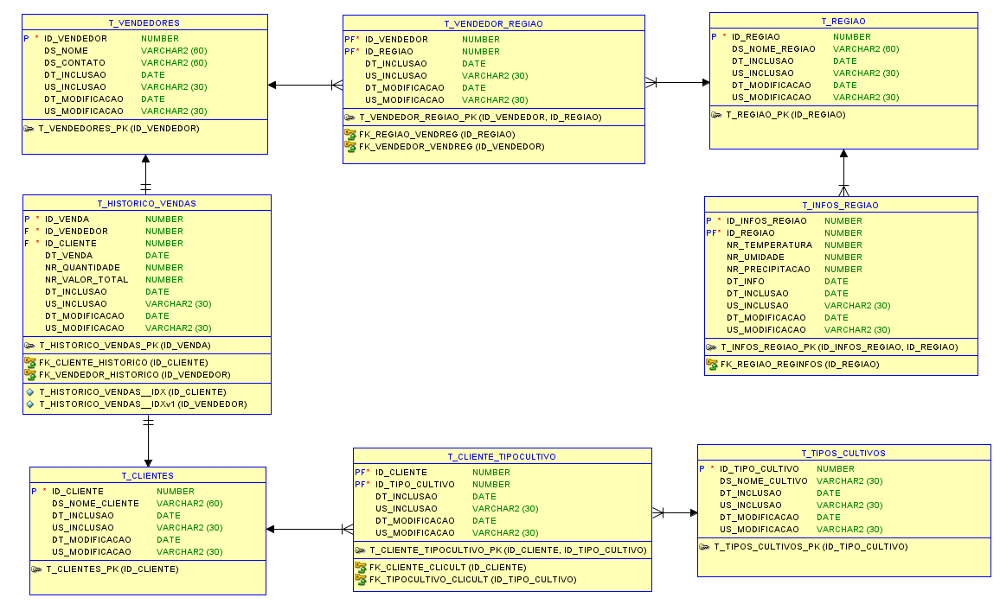
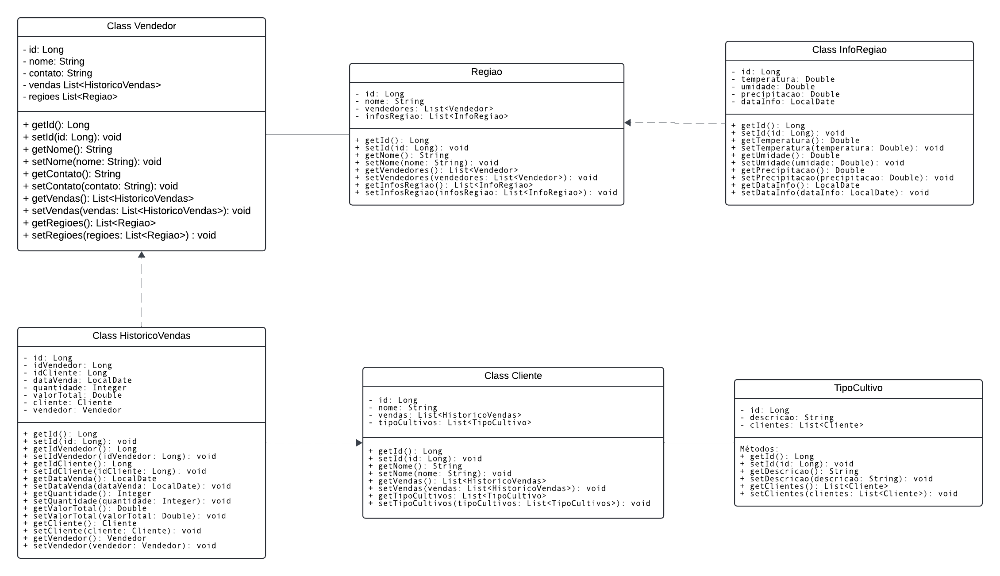

# Nome da Aplicação: Agro+

## Integrantes:
- **Lucas Petroni** - Responsável pelo desenvolvimento do frontend da aplicação.
- **Matheus Paulo Lima Delgado** - Responsável pelas atividades relacionadas a IA e infraestrutura.
- **Caio Boris** - Responsável por gravar o pitch e criar a documentação sobre a ideia do projeto.
- **Nathaly Oliveira** - Responsável pela criação da base de dados e API.
- **Denner Duarte** - Responsável pela realização da API.

## Instruções para rodar a aplicação:
Ao clonar a aplicação e importá-la na IDE de preferência, rodar a classe `AgroplusApplication`. O servidor acoplado à aplicação iniciará, ficando disponível para uso na URL `http://localhost:8080`.

## Links
- **Link do pitch no YouTube**: [Clique aqui](https://youtu.be/HcsZzeJStkQ)
- **Link da aplicação**: [Clique aqui](https://movtoagroplus-rm552189.azurewebsites.net/)
- **Link da apresentação técnica**: [Clique aqui](https://drive.google.com/file/d/1tIzVavyJDZvb4PIGuE8H-z6XuM4S2qa1/view?usp=sharing)

## Endpoints

### Clientes
- **Obter todos os Clientes**
  - **Método**: `GET`
  - **Endpoint**: `/api/clientes`
  - **Resposta**:
    ```json
    [
      {
        "id": 3,
        "nome": "Matheus",
        "tipoCultivos": [],
        "vendas": []
      },
      {
        "id": 4,
        "nome": "Maria da Silva",
        "tipoCultivos": [],
        "vendas": []
      },
      {
        "id": 10,
        "nome": "Teste Menk - Updated",
        "tipoCultivos": [],
        "vendas": []
      }
    ]
    ```

- **Obter Cliente por ID**
  - **Método**: `GET`
  - **Endpoint**: `/api/clientes/{id}`
  - **Exemplo de Requisição**:
    ```
    GET /api/clientes/1
    ```
  - **Resposta**:
    ```json
      {
        "id": 1,
        "nome": "Nathaly",
        "tipoCultivos": [],
        "vendas": []
      }
    ```

- **Criar Cliente**
  - **Método**: `POST`
  - **Endpoint**: `/api/clientes`
  - **Exemplo de Requisição**:
    ```json
    {
      "nome": "Cliente Novo"
    }
    ```
  - **Resposta**:
    ```json
    {
      "id": 3,
      "nome": "Cliente Novo",
      "tipoCultivos": [],
      "vendas": []
    }
    ```

- **Atualizar Cliente**
  - **Método**: `PUT`
  - **Endpoint**: `/api/clientes/{id}`
  - **Exemplo de Requisição**:
    ```json
    {
      "nome": "Cliente Atualizado"
    }
    ```
  - **Resposta**:
    ```json
    {
      "id": 1,
      "nome": "Cliente Atualizado",
      "tipoCultivos": [],
      "vendas": []
    }
    ```

- **Deletar Cliente**
  - **Método**: `DELETE`
  - **Endpoint**: `/api/clientes/{id}`
  - **Exemplo de Requisição**:
    ```
    DELETE /api/clientes/1
    ```

### Vendedores
- **Obter todos os Vendedores**
  - **Método**: `GET`
  - **Endpoint**: `/api/vendedores`
  - **Resposta**:
    ```json
    [
    	{
    		"id": 3,
    		"nome": "Natureza Ltda",
    		"contato": "natureza.ltda@naturezaltda.com.br",
    		"vendas": [],
    		"regioes": []
    	},
    	{
    		"id": 7,
    		"nome": "Menk",
    		"contato": "menk@gmail.com",
    		"vendas": [],
    		"regioes": []
    	}
    ]
    ```

- **Obter Vendedor por ID**
  - **Método**: `GET`
  - **Endpoint**: `/api/vendedores/{id}`
  - **Exemplo de Requisição**:
    ```
    GET /api/vendedores/3
    ```
  - **Resposta**:
    ```json
    {
    	"id": 3,
    	"nome": "Natureza Ltda",
    	"contato": "natureza.ltda@naturezaltda.com.br",
    	"vendas": [],
    	"regioes": []
    }
    ```

- **Criar Vendedor**
  - **Método**: `POST`
  - **Endpoint**: `/api/vendedores`
  - **Exemplo de Requisição**:
    ```json
    {
      "nome": "Novo Vendedor",
      "contato": "contato@vendedor.com"
    }
    ```
  - **Resposta**:
    ```json
    {
      "id": 3,
      "nome": "Novo Vendedor",
      "contato": "contato@vendedor.com"
    }
    ```

- **Atualizar Vendedor**
  - **Método**: `PUT`
  - **Endpoint**: `/api/vendedores/{id}`
  - **Exemplo de Requisição**:
    ```json
    {
      "nome": "Vendedor Atualizado",
      "contato": "novo@vendedor.com"
    }
    ```
  - **Resposta**:
    ```json
    {
      "id": 1,
      "nome": "Vendedor Atualizado",
      "contato": "novo@vendedor.com"
    }
    ```

- **Deletar Vendedor**
  - **Método**: `DELETE`
  - **Endpoint**: `/api/vendedores/{id}`
  - **Exemplo de Requisição**:
    ```
    DELETE /api/vendedores/1
    ```

### Tipos de Cultivo
- **Obter todos os Tipos de Cultivo**
  - **Método**: `GET`
  - **Endpoint**: `/api/tiposCultivos`
  - **Resposta**:
    ```json
    [
      {
        "id": 1,
        "descricao": "Milho"
      },
      {
        "id": 2,
        "descricao": "Café"
      },
      {
        "id": 3,
        "descricao": "Soja"
      }
    ]
    ```

- **Criar Tipo de Cultivo**
  - **Método**: `POST`
  - **Endpoint**: `/api/tiposCultivos`
  - **Exemplo de Requisição**:
    ```json
    {
      "descricao": "Novo"
    }
    ```
  - **Resposta**:
    ```json
    {
      "id": 5,
      "descricao": "Novo"
    }
    ```

## Diagramas

### Diagrama de Entidades e Relacionamentos


### Diagrama de Classes


### Arquitetura

