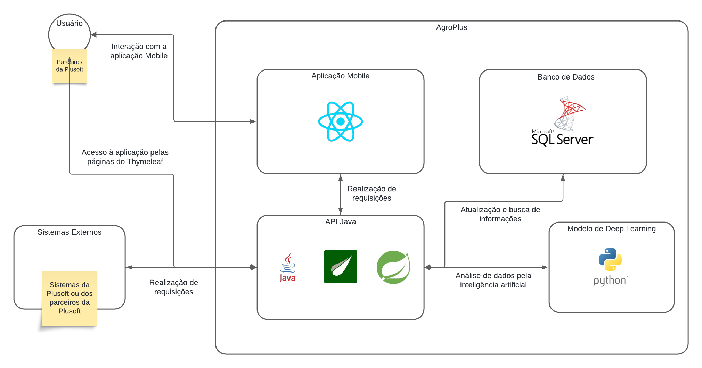

<h1>Nome da Aplicação: Agro+</h1>

<h3>Integrantes: </h3>
<ul>
    <li>Lucas Petroni - Responsável pelo desenvolvimento do frontend da aplicação.</li>
    <li>Matheus Paulo Lima Delgado - Responsável pelas atividades relacionadas a IA e infraestrutura.</li>
    <li>Caio Boris - Resposável por gravar o pitch e criar a documentação sobre a ideia do projeto.</li>
    <li>Nathaly Oliveira - Responsável pela criação da base de dados e Api.</li>
    <li>Denner Duarte - Responsável pela realização da API.</li>
</ul>

<h3>Intruções para rodar a aplicação: </h3>

Ao clonar a aplicação e importá-la na IDE de preferência, rodar a classe 'AgroplusApplication'. O servidor acoplado à aplicação iniciará, ficando disponível para uso na URL localhost:8080.

 
<h3>Link do pitch no youtube: </h3>
 https://youtu.be/HcsZzeJStkQ 
 

 
<h3>Link da aplicação: </h3>
 https://agroplusjava-endzbyczhyccajbh.brazilsouth-01.azurewebsites.net/
 

 
<h3>Link do Swagger: </h3>
 https://agroplusjava-endzbyczhyccajbh.brazilsouth-01.azurewebsites.net/swagger-ui/index.html
 

<h3>EndPoints: </h3>

<ul>
    <li>GET /api/vendedor</li>
    <li>GET /api/vendedor/{id}</li>
    <li>POST /api/vendedor</li>
    <li>PUT /api/vendedor/{id}</li>
    <li>DELETE /api/vendedor/{id}</li>
</ul>

<ul>
    <li>GET /api/cliente</li>
    <li>GET /api/cliente/{id}</li>
    <li>POST /api/cliente</li>
    <li>PUT /api/cliente/{id}</li>
    <li>DELETE /api/cliente/{id}</li>
</ul>

<ul>
    <li>GET /api/tiposCultivos</li>
    <li>POST /api/tiposCultivos</li>
</ul>

<h1>Diagramas</h1>

<h3>Diagrama de Entidades e Relacionamentos</h3>

 
<h3>Diagrama de Classes</h3>

 
<h3>Arquitetura</h3>

